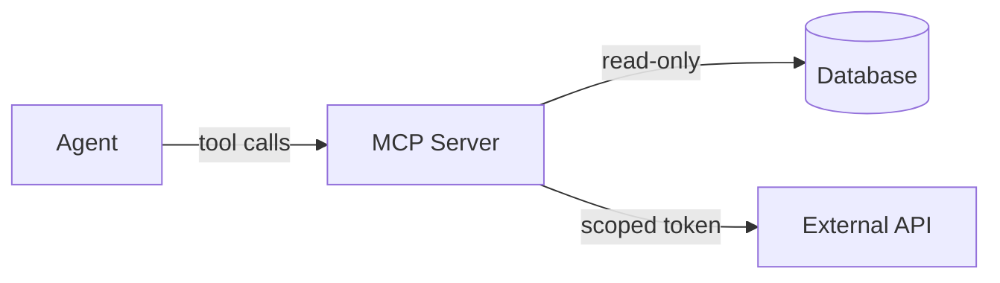

# Security

> Least-privilege security model for AI agents and MCP tools

[← Back to handbook](../README.md)

---

AI agents can take real-world actions — write files, run commands, call APIs. That makes security hygiene more important than ever.

## 🔒 Least Privilege, Always

**MCP (Model Context Protocol)** — an open standard that lets AI agents connect to external tools: web browsers, terminals, databases, file systems, and external APIs. Each connection is an MCP server. Because agents can take real actions through these servers, controlling what they can access is critical.

When connecting agents to external tools via MCP, follow these principles:

- **Start read-only** — give agents write access only when absolutely needed, and only to what they need
- **Isolate high-risk tools** — anything touching the browser, filesystem, or terminal should run in a sandboxed container (a Docker container or VM with no network or filesystem access beyond what the specific task requires)
- **Require user consent** for any elevated permissions
- **Log everything** — audit all tool access so you can trace what the agent did and why. Each entry should record: timestamp, tool name, action, inputs, and outcome. [Full annotated example →](../examples/security/audit-log-entry.json)
- **Pin and review tool manifests** — treat them like code dependencies; don't blindly trust them. A manifest is the JSON/YAML file that declares what an MCP server can do and what permissions it requests — read it before installing.

---

## 🔍 MCP Server Vetting

> [!WARNING]
> Never install an MCP server you haven't read. A malicious server can exfiltrate code, credentials, or secrets through legitimate-looking tool calls.

Before adding an MCP server to your setup:

1. Review the server's manifest and source code if available
2. Confirm it's from a trusted publisher — look for: source-available code, an org-owned repository, a history of maintained releases, and publication in an official registry
3. Pin it to a specific version — don't use floating `latest` references
4. Scope its permissions to only what the current task requires — e.g., a file-reader MCP should have access to `src/` only, not your home directory
5. Remove it when the task is done if it's not needed ongoing

---

## ✅ Human Approval Gates

Some actions should always require explicit human approval before an agent proceeds:

- Database schema migrations
- Production deployments
- Installing new dependencies
- Modifying CI/CD configuration
- Any action that touches secrets or credentials

Build these gates into your workflow explicitly, not as an afterthought. In practice this means one of:

- A rule in your `AGENTS.md` / `CLAUDE.md`: `⚠️ Ask first: run database migrations, deploy to production`
- A GitHub Actions `environment:` block requiring a named reviewer before the job runs
- A CI step that pauses and posts a Slack/Teams message requesting sign-off

---

## 📤 What to Send to AI Providers

> [!WARNING]
> Treat everything you paste into a cloud AI prompt as potentially logged. Strip real customer data, credentials, and internal hostnames before sending.

Every prompt you send to a cloud AI provider — code snippets, error messages, variable names — leaves your environment. Before using a cloud-based coding assistant, classify what you're sending.

**A simple four-tier model:**

| Tier | Examples | Default |
|------|----------|---------|
| Public | Open-source code, public docs | Safe to send |
| Internal | Business logic, system design | Send with care |
| Restricted | Customer PII, financial records | Do not send |
| Secret | Credentials, private keys | Never send |

> [!TIP]
> When in doubt, default to Tier 1 (read-only) MCP servers and Restricted data handling. Escalate permissions only when the task genuinely requires it.

**What the major providers do with your data (early 2026):**

- **Anthropic (Claude)** — API requests are not used to train models by default. Enterprise customers get contractual data processing guarantees.
- **GitHub Copilot** — Opt out of telemetry in settings; enterprise plans offer zero-data retention.
- **Cursor** — Privacy Mode disables code transmission to third-party models; data is not used for training by default.

Check your provider's current policy directly — these terms change.

**When to use a local model instead.** If your codebase contains customer PII, health records, financial data, or anything covered by HIPAA, SOC 2, or GDPR, run a local model. [Ollama](https://ollama.com) runs models like Llama, Mistral, and Qwen on your own hardware — no data leaves your machine. Capability is lower than frontier cloud models, but the privacy guarantee is absolute.

**Before sending any snippet to a cloud provider:**

- Strip real customer data — use placeholders (`user@example.com`, `tok_test_xxx`)
- Remove credentials — even if you think they're already rotated
- Replace internal hostnames with generics (`internal-service.corp` → `api.example.com`)
