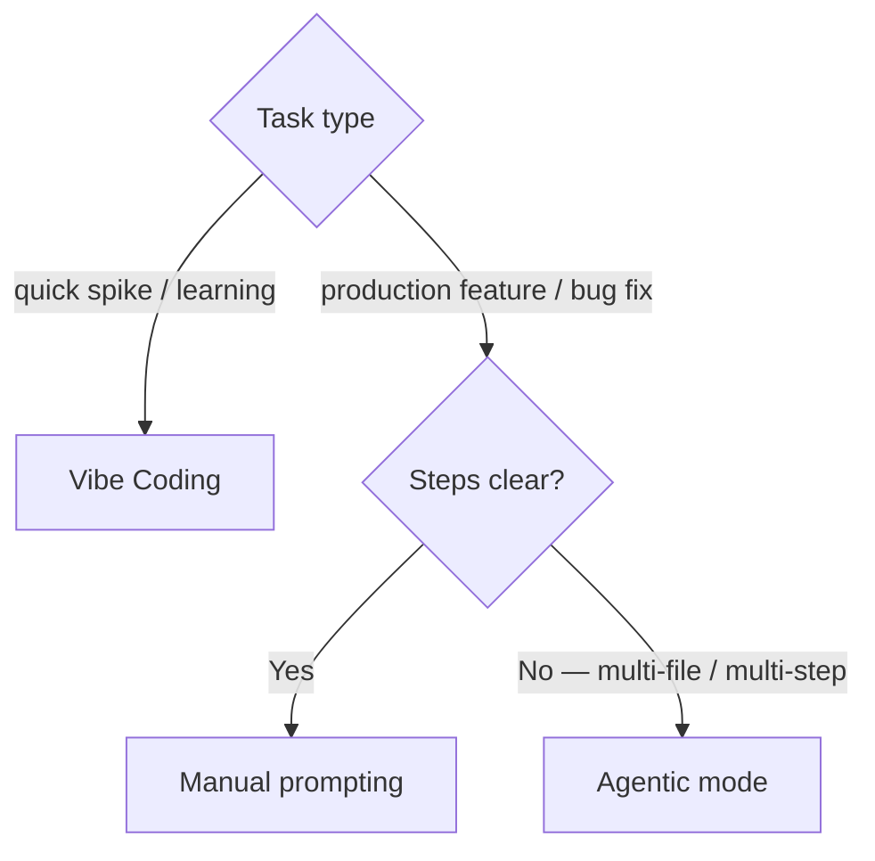

# Tools

> Which AI coding tool to use for which task

[← Back to handbook](../README.md)

---

## 🔧 Three Ways to Code with AI

Think of it as a spectrum from fast-and-loose to structured-and-safe:



**Vibe Coding** — Use this for speed
Tools like Vercel's v0, Lovable, or Bolt.new let you describe what you want and get a working prototype fast. Great for landing pages, dashboards, and internal tools. Not appropriate for anything security-critical — meaning: authentication flows, payment processing, encryption, access control, or anything that handles personal data.

**Manual Coding (with AI assist)** — Use this when correctness is non-negotiable
Security components, performance-sensitive code, complex business logic, or anything under regulatory scrutiny. GitHub Copilot helps with boilerplate, but the human writes the intent, reviews every diff line-by-line, and decides what ships. The AI suggests; the human approves.

**Agentic Workflows** — Use this for complex, multi-step tasks
Tools like Cursor, Claude Code, and LangGraph can plan a task, execute it in steps, run tests, and retry on failure. Best for large refactors, framework migrations, and cross-service integrations.

---

## 🏆 The Best Tools Right Now (March 2026)

**For big, complex reasoning across many files:**
- **Claude Code** — Terminal-based agent with a massive context window (up to 1 million tokens). Excellent for deep debugging, migrations, and multi-file refactors. *(A context window is the amount of text — code, instructions, conversation history — the model can see at once. A token ≈ 1 word or 4 characters. More tokens = more of your codebase in view at once.)*
- **Cursor** — Best-in-class IDE agent with strong built-in guardrails, rule files (see [codebase-setup](../codebase-setup/README.md) for how to write them), and enterprise controls. The go-to for daily production coding.

**For safe large-scale refactoring:**
- **Windsurf Cascade** — Works in isolated Git branches so parallel changes don't collide. Good for multi-agent experiments and big refactors.

**For quick prototypes and UI:**
- **Vercel v0** — Builds full-stack Next.js apps, creates Git branches, and opens pull requests. Best if you're on the Next.js/Vercel stack.
- **Bolt.new** — Full dev environment in the browser. Great for turning an idea into a running app quickly.
- **Lovable.ai** — Focused on teams and enterprise needs, with two-way GitHub sync.

**For everyday code completion:**
- **GitHub Copilot** — Still excellent for inline suggestions and test generation.
- **Local models via Ollama** — Fast, private, and free from cloud API costs. Worth it for repetitive, low-stakes completions.

---

## 🤖 MCP Servers

**MCP (Model Context Protocol)** — an open standard that lets agents call external tools: web browsers, databases, file systems, and APIs. Each tool is an MCP server.

By default, an agent can only read and write files in its context. MCP is how you give it live access to external state — query a database, search the web, open a pull request — without pasting that data into the prompt manually.

**When to use one:**
- The agent needs live external data to do its job correctly — e.g., reading your DB schema before writing a migration, or browsing docs for an unfamiliar library
- You're connecting the agent to your team's tooling (GitHub, Linear, Slack)
- You're running browser-driven tasks: web research, E2E testing, scraping

**When not to:**
- Simple coding tasks that don't need external data — every MCP server is extra attack surface
- Unvetted servers from unknown publishers — see [security/](../security/README.md) for the full vetting checklist

> [!WARNING]
> MCP servers run code on your machine. Only install from trusted, source-available publishers — and pin to a specific version, not `latest`.

**Common servers:**

| Server | What the agent gains |
|--------|----------------------|
| `filesystem` | Scoped read/write to specified directories |
| `github` | PR/issue creation, repo search, code review |
| `playwright` | Browser control for research and E2E testing |
| `postgres` / `sqlite` | Direct DB queries |
| `slack` | Channel reads, message posting |

**Configuration — Claude Code (`.mcp.json` in project root):**

```json
{
  "mcpServers": {
    "filesystem": {
      "command": "npx",
      "args": ["-y", "@modelcontextprotocol/server-filesystem", "./src"]
    },
    "github": {
      "command": "npx",
      "args": ["-y", "@modelcontextprotocol/server-github"],
      "env": { "GITHUB_TOKEN": "ghp_..." }
    }
  }
}
```

Scope `filesystem` to the narrowest path the task needs — `./src`, not your home directory.

---

## ⚡ Agent Skills & Slash Commands

**Agent skills** — reusable instructions stored as `SKILL.md` files that extend what an agent can do. The `name` field in the frontmatter becomes a `/slash-command`. The agent invokes the skill automatically when the conversation matches its description, or you invoke it manually with `/skill-name`.

Skills follow an [open standard](https://agentskills.io) supported by Claude Code, GitHub Copilot, Cursor, OpenAI Codex, and 30+ other tools. A skill written for one agent runs unchanged in the others.

**Minimal example** — `.claude/skills/commit/SKILL.md`:

```yaml
---
name: commit
description: Create a conventional commit for staged changes
disable-model-invocation: true
---

Create a conventional commit for the currently staged changes.
Format: <type>(<scope>): <summary>
Run git diff --staged first to understand what changed.
```

Invoke with `/commit`. The `disable-model-invocation: true` field prevents Claude from committing automatically when code looks ready — you control the trigger.

**Claude Code bundled skills** — available in every session, no setup required:

> [!TIP]
> These skills are already loaded in every Claude Code session — no install or configuration needed. Just type the slash command.

| Skill | What it does |
|-------|-------------|
| `/simplify` | Reviews recently changed files for reuse, quality, and efficiency — runs 3 parallel review agents |
| `/batch <instruction>` | Breaks a large change into 5–30 units, spawns one background agent per unit in isolated git worktrees |
| `/debug` | Troubleshoots the current session by reading its debug log |
| `/loop [interval] <prompt>` | Runs a prompt on a recurring schedule — e.g. `/loop 5m check if the deploy finished` |
| `/claude-api` | Loads Claude API + Agent SDK reference; also activates when your code imports `anthropic` |

[Full guide: Agent Skills & Slash Commands →](skills/README.md)

---

## 🖥️ Interactive vs Scripted

Agents run in two modes. The tool — Claude Code, Cursor, or any other — can support both; the question is which mode fits the task.

**Use interactive mode when:**
- Working through a problem iteratively and expecting to steer mid-way
- Reviewing changes as the agent makes them
- The task is exploratory and the right approach isn't clear upfront

**Use scripted/automated mode when:**
- Running agents in CI/CD pipelines
- Batch-processing many files: *"add JSDoc to every exported function in `src/lib/`"*
- Recurring scheduled tasks (dependency updates, lint sweeps)
- Piping agent output into other tools

**Common Claude Code scripted patterns:**

```bash
# One-shot task
claude "add input validation to all route handlers in src/app/"

# Feed a specific file in as context
claude "refactor for readability" < src/use-cases/RegisterUser.ts

# Non-interactive mode — capture output as text, for CI scripts
claude --print "summarize test failures in the last run"

# Resume a previous interactive session
claude --resume
```

Run `claude --help` for the full flag reference.

---

### 📖 Terms used on this page

<details>
<summary><strong>MCP server</strong></summary>

A process that exposes a set of callable tools to an AI agent over the Model Context Protocol. The agent can invoke these tools — read a file, run a DB query, open a browser tab — as structured actions rather than free-form text generation. Each server declares what it can do in a manifest; the agent calls only what it's been granted access to.

</details>

