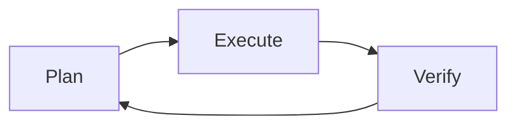

# Workflow

> The Plan → Execute → Verify loop, and the full cycle from idea to production

[← Back to handbook](../README.md)

---

> [!NOTE]
> **TL;DR** — Structure every task with Plan → Execute → Verify. Keep PRs small and stacked. Monitor cost with context budgets and RAG.

## 🔄 Plan → Execute → Verify (PEV)

The most important concept in agentic development is the PEV loop. Don't just ask an agent to "go build X." Structure it:



1. **Plan** — Have the agent outline its approach. Review it before a single line of code is written. Use the [four-block prompt pattern](../prompting/README.md) to structure complex requests.
2. **Execute** — The agent works through the plan step by step, using tools like a terminal or code search.
3. **Verify** — After each step, check the result. Run tests. If something fails, retry or replan.

> [!TIP]
> **Verification-Aware Planning** — Attach a specific test or acceptance check to each step upfront. The agent can't move to the next task until the previous one passes its check. This prevents snowballing failures.

Example — task: *"Add a `created_at` field to the User model and expose it in the API"*:
- Step 1 check: `tsc --noEmit` passes with no errors
- Step 2 check: migration runs without errors on a local DB snapshot
- Step 3 check: `GET /users/:id` returns `created_at` in ISO 8601 format

### Guardrails to Add

- **Loop detection** — Stop the agent if it's retrying the same failing action in circles. A practical threshold: 3 identical failures on the same step = stop and escalate to a human.
- **Circuit breakers** — Halt automatically if cost or time exceeds your limits. A reasonable starting point: $5 budget or 10-minute time cap per task; adjust based on your workflow.
- **Human approval gates** — Require a human to sign off before irreversible actions like database migrations or production deploys

### Breaking Down Tasks

Smaller tasks = better results. Aim for atomic units of work — each one ideally fitting into a pull request under 200 lines. A good task is *"Add a `created_at` field to the User model and expose it in the API."* A bad task is *"Build the user profile page."*

---

## 🚀 The End-to-End Workflow

**Day 0: Prototype**
Use a vibe tool to scaffold the UI and structure from a prompt. Do this inside a Git repo from the start, with a `CLAUDE.md` or `AGENTS.md` already in place.

**Day 0: Bootstrap the repo**
Add linting, formatting, type-checking, and a basic CI pipeline (GitHub Actions) before writing any real code.

**Daily: Development loop**
Work in an agent-assisted IDE. The agent follows the rules in your rules file, commits frequently using Conventional Commits (`feat:`, `fix:`, `refactor:`), and runs local tests before pushing.

**Per feature: Open a small PR**
Target 100–300 lines changed across 3–8 files. Larger features should be broken into a series of small, stacked PRs — each building on the previous.

> [!TIP]
> Stacked PRs let reviewers merge incrementally without waiting for the entire feature. Each PR is independently reviewable, testable, and revertable. Tools like [Graphite](https://graphite.dev) manage the stack automatically.

Example for a "user notifications" feature:
- PR 1: add the `notifications` DB table and model
- PR 2: add the API endpoint (depends on PR 1)
- PR 3: add the UI component (depends on PR 2)

Each PR automatically triggers the full CI pipeline.

**Per PR: Human review**
At least one human must review every PR. See [`templates/review-checklist.md`](../templates/review-checklist.md) for a complete checklist.

**On merge: Deploy**
Merge to main triggers production deployment, which includes a final security scan and smoke tests.

**Continuously: Observe and improve**
Monitor errors and performance. Feed incidents back into the development loop. Update your rules files as you learn.

---

## 💰 Cost Optimization

Long context windows (1M tokens) are impressive but expensive. **RAG (Retrieval-Augmented Generation)** — fetching only the relevant documentation or code snippets at query time rather than loading everything upfront — is dramatically cheaper: some analyses show 100× lower cost. Use RAG to pull in only what the agent needs for the current task, and reserve the full context window for truly complex, multi-file operations.

---

## 🤝 Multi-Agent Coordination

Running multiple agents in parallel can compress task time significantly, but uncoordinated agents collide — two agents editing the same file produce conflicts that are harder to fix than doing the work sequentially.

**Split work by file boundary, not by concept.** Two agents can work safely in parallel only if they touch completely separate files. A practical split:

- Agent A: backend (`src/use-cases/`, `src/lib/`)
- Agent B: frontend (`src/components/`, `src/app/`)

**Use git worktrees for isolation.** Each agent works in its own worktree — a separate checkout of the repo on its own branch. When both finish, merge normally.

```bash
git worktree add ../feature-api api-changes
git worktree add ../feature-ui  ui-changes
# Agent A works in ../feature-api, Agent B in ../feature-ui
```

**Orchestrator pattern.** For complex tasks with dependencies between subtasks, use one agent as orchestrator: it breaks the work into subtasks, assigns them, and reviews results before proceeding. Don't start all agents simultaneously without a dependency graph — if Agent B needs Agent A's output (e.g., a new API endpoint), B must wait.

**After parallel work:** review each branch's diff independently, resolve any conflicts manually, then run the full test suite. Per-agent tests won't catch integration failures.

---

## ⚠️ When an Agent Goes Wrong

Agents fail in three distinct ways, each needing a different response:

| Failure mode | Signs | Response |
|---|---|---|
| **Loop** | Same failing action 3+ times | Stop. Don't retry the same prompt. |
| **Divergence** | Output looks correct but goes in the wrong direction | Stop early. Replan. |
| **Misunderstanding** | Agent edits files outside scope, or asks confused questions | Inspect scope. Add explicit constraints. |

**Assess the damage first.** Run `git diff` and `git log --oneline` to see exactly what changed before doing anything else.

**Recovery options, in order of preference:**

1. **Cherry-pick the good parts.** If the agent completed 3 of 5 steps correctly, reset to the last clean commit and manually restore the good files: `git checkout <good-commit> -- path/to/file`.
2. **Reset and restart.** If changes are entangled: `git reset --hard <last-good-commit>`, then open a new session with a tighter scope.
3. **Abandon and rethink.** If the failure reveals the task was poorly scoped, rethink before retrying — not just re-running the same prompt.

**When restarting, change the prompt.** Include what went wrong as an explicit constraint: *"A previous attempt modified `stripe.ts` — do not touch `src/lib/stripe.ts` under any circumstances."* Feed failure back in as scope restrictions, not just encouragement to try again.

---

## 🔀 Git Hygiene During Agentic Sessions

Agents can make many file changes quickly. Protect yourself:

```bash
# Before starting an agentic task
git checkout -b agent/my-task-name

# Commit frequently during the session
git add -p   # stage selectively
git commit -m "wip: agent added user auth middleware"

# After the task is complete and reviewed
git checkout main
git merge --squash agent/my-task-name
git commit -m "feat: add user auth middleware"
```

**Never let an agent work on `main` directly.**

---

## 👥 Working in Teams

AI-assisted development changes team dynamics in specific ways that need explicit norms.

**Treat AGENTS.md like a CI config.** It governs every teammate's agent sessions. Changes to it should go through code review. Add it to `CODEOWNERS`:

```
AGENTS.md   @your-team/leads
CLAUDE.md   @your-team/leads
```

**One agent session, one PR.**

> [!WARNING]
> Running multiple agents on overlapping areas simultaneously without coordination produces conflicting diffs that are harder to review than doing the work sequentially. Agree on file ownership before starting parallel agent work.

When multiple engineers run agents on overlapping areas simultaneously, outputs conflict and reviews get messy. Coordinate before starting parallel agent work — agree on who owns which files, just as you would for any branch.

**Attribute AI-generated code in commit messages.** This helps reviewers calibrate scrutiny and creates an honest audit trail:

```
feat(auth): add JWT refresh endpoint

Co-authored-by: Claude Sonnet 4.6 <noreply@anthropic.com>
```

**Review AI-generated PRs for intent, not just correctness.** AI code can be syntactically perfect, pass all CI checks, and still do the wrong thing. The review question "Did the author document what the agent was asked to do?" matters most — if there's no PR description, ask for one before approving. See [`templates/review-checklist.md`](../templates/review-checklist.md) for the full checklist.

**When two agents produce conflicting approaches:** resolve it in PR review, not by silently overwriting one. Record why one approach was chosen — future agents and teammates will encounter the same decision.

---

### 📖 Terms used on this page

<details>
<summary><strong>Atomic unit of work</strong></summary>

A change small enough that it can be reviewed, tested, merged, and reverted independently. A good atomic unit fits in one PR and does one thing: adds a field, fixes a bug, or refactors one module. If reverting it would break something else, it's not atomic enough.

</details>

<details>
<summary><strong>Stacked PRs</strong></summary>

A chain of small pull requests where each one builds on the previous. Used when a feature is too large for one PR: each PR is individually reviewable and mergeable, and the chain progresses once each is approved. Tools like [Graphite](https://graphite.dev) manage stacked PRs automatically.

</details>

<details>
<summary><strong>Smoke tests</strong></summary>

A minimal set of tests that verify the app starts up and its core paths respond — not correctness, just "is it alive." Run after every deployment to catch catastrophic failures before running a full test suite. Named after the hardware test: power it on and see if anything smokes.

</details>

<details>
<summary><strong>Git worktree</strong></summary>

A separate working directory linked to the same repository, allowing multiple branches to be checked out simultaneously. `git worktree add ../path branch-name` creates a new directory on a given branch without touching your current checkout. Useful for letting two agents work in parallel without interfering with each other.

</details>

<details>
<summary><strong>Orchestrator</strong></summary>

In multi-agent setups, the agent responsible for planning, delegating, and reviewing — it coordinates other agents rather than doing implementation work directly. The orchestrator breaks a large task into subtasks, assigns each to a worker agent, verifies the results, and decides what comes next.

</details>

<details>
<summary><strong>Conventional Commits</strong></summary>

A commit message format: `type(scope): description`. The type signals the nature of the change — `feat` for new features, `fix` for bug fixes, `refactor`, `test`, `docs`, `chore`. Example:

```
feat(auth): add JWT refresh endpoint
fix(payments): handle Stripe webhook timeout
```

Tools like [commitlint](https://commitlint.js.org) can enforce this automatically in CI.

</details>
